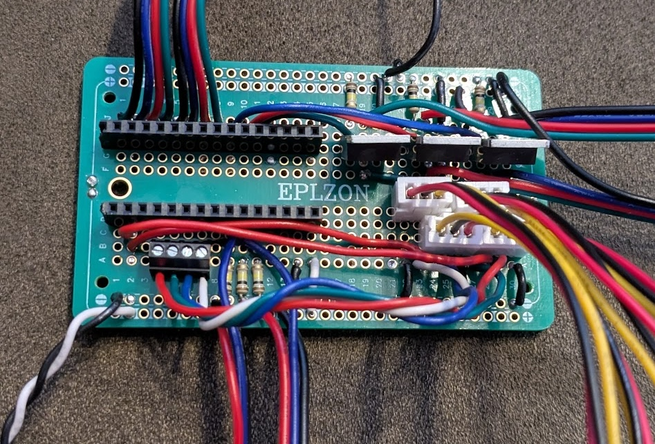

# DIY Light Controls for Child's Secret Hideout

This repository holds code, circuit diagrams, and general instructions for building a
control system for LED light strips.  The goal here is not to be inexpensive, but to be
educational and cool.  Similar results might be achieved using pre-built controls
for LED light strips, but the purpose here is to demonstrate principles of electronics and
have fun with the child.

This setup uses button and dial controls to allow for any RGB color to be selected, and for
various pre-programmed routines to be activated.  Additionally, it connects to passive 
infrared (PIR) sensors to detect when a child is present and turn off after a period otherwise,
to save power.

## Basic Setup and Parts

### Main Components

* Arduino Nano ESP32: A microcontroller with a built-in LED and lots of flexibility for inputs
and outputs.  Connects via USB for programming, compatible with 12V power in and 3.3V logic and 
analog inputs.  I recommend getting the [version with header pins](https://www.sparkfun.com/arduino-nano-esp32-with-headers.html).

* PIR sensors: These cheaply and effectively detect the presense of a person.  Be sure to get
sensors compatible with the Arduino (the key thing is 3.3V logic).  I got [these ones](https://www.amazon.com/dp/B07KZW86YR).  The main drawback is that they are fairly awkward to mount.

* RGB non-addressable LED strip: I purchased [two of these](https://www.adafruit.com/product/4245), and they're bright and
work great.  The key thing is that they're fully-encased in rubber, so they won't get damaged by curious
children.  They connect to 4 wires: shared 12V power, and then separate grounds for red, green, and blue.
Note that these will only show one color at a time.  Digital addressable LEDs are a project for a different
day.

* 12V power supply: Need a power supply capable of at least 30W.

### Other Parts

* At least 4 [10k potentiometers](https://www.amazon.com/dp/B0D2991CBF).  I recommend getting ones with leads already soldered to them.  You may separately want to get colored dials for them.

* Various wires, disconnects, solder, 4-conductor cables, mounting materials.

* A [breadboard](https://www.amazon.com/EPLZON-Solder-able-Breadboard-Electronics-Compatible) on which to build the setup.

* At least 3 [MOSFET transistors](https://www.digikey.com/en/products/detail/infineon-technologies/IRLB8743PBF/2127671) to drive the LEDs.

* Standoffs, likely for M2 and M2.5 threads, and associated hardware.

* Six 100 kΩ resistors.

* Female headers to create a socket for the Arduino.

* At least [8 colorful buttons](https://www.amazon.com/dp/B0752RMB7Q) for the controls.

* Plexiglass for mounting the hardware to while maintaining visiblity.

* Cable ties.

* Heat shrink tube for cable splices.

### Other Thoughts

* If I could start again, I'd make sure that all the cables going out of the control box go through
bulkhead connectors on the side or top.  Strain relief is a real issue when kids are exploring.

* A guiding principle is to make sure everything can be dismantled for repair, upgrades, or tinkering
as needed.  Every connection to the breadboard should be able to be disconnected.

* Another thing I might consider doing (though it doesn't actually matter much) is putting some dark
paint over the green power LED.  No need to draw attention to it.  It turns out not to be much of an issue,
as the power brick's built-in LED is already much brighter.

* Feel free to experiment with a solder-less breadboard, see what works.  One warning, however: when using
the PIR sensors, be careful not to let the 12V power touch the signal, for example, using alligator clips
while testing.  This will destroy the Arduino.  It should be possible to protect the Arduino, at least
to a degree, from this sort of error, but it requires a fair few more components, and likely some
trade-offs.  No, a 3.3V zener diode wouldn't be able to save you.

## Circuit Board Layout

Here is the board design.  Note that the potentiometers have XH2.54 sockets to make connecting and 
disconnecting easy.  Four-wire plugs are primarily used to make connecting and disconnecting the board easy,
although the button ground uses a WAGO style splice connector.

Main features:
* Eight digital inputs on pins D5-D12 for the eight buttons.

* Pulse width modulation (PWM) outputs for RGB on pins D2-D4.

* Pulled-down PIR digital inputs on pins A5-A7.

* Potentiometer analog inputs on pins A0-A3.

* MOSFETS to drive the LEDs.

* 12V power for the Arduino, LED strips, and PIR sensors

A few GPIO pins remain available for future expansion.

## Controls Board Layout

The entire controls board is mounted between two plexiglass sheets (though, as described above, this isn't
ideal for strain relief).  The buttons and potentiometers were installed through holes drilled in the boards, and the boards themselves are held together with standoffs and screws.  On the back side, rubber feet and a single screw hold the rear board stable on the wall of the secret hideout.

The control is designed to be intuitive -- use RGB dials for setting RGB colors, and the white dial for 
setting the white brightness in white mode.  The cycle button will simply cycle between modes, and the off
button does what it says.  Finally, there are 4 special buttons.  These are meant for fun.  They can trigger
specific colors, or pre-programmed routines.  And, combinations of the buttons may activate secret
functionality.  Have fun!

Another fun feature is that the main output LED from the board is used to provide feedback to the user
without making any sounds (I'm a parent, I get it!).  It will play a brief sequence of colors after
modes are changed to indicate the mode it has just entered.  This is also something to have fun with!

## Installation

Cable ties are great.  I attached the lights to the center bar on the roof of the secret hideout
using cable ties.  I could also use an adhesive, but I wanted everything to be easily removeable.

Be sure, when installing everything, to manage your cables well and ensure all parts are
securely installed, but capable of being removed in the future.  The PIR sensors, in particular,
are frustrating.  I used the foam backing that the arduino came with to make a back-plate for the
PIR sensors, and attached it with screws and standoffs.  Then, that could be attached to the walls.

## Controls Code

The code was all developed using VS code and the PlatformIO extension.  I found this easy to use and
much more capable than the basic Arduino IDE.  We use C++ but avoid most the standard libraries, to keep
the executable small.  Execution speed is important to keep everything responsive and stable.  I used
object-oriented principles where useful, for example, to deal with noisy ADC inputs and reduce it to a
simple interface for an analog input, or a debounced digital input.

The code has a fair few comments with ideas to help you understand the decisions and plan for ways to
make this project your own.

## Various Observations and Ideas

* We use pulse width modulation (PWM) to make the light outputs produce any shade of any color we want.
The frequency is well above the level of human perception, and it appears quite stable.  If you experience
some flickering, it is likely due to noisy ADC inputs causing the PWM level to change rapidly.  I actually
found that different 12V power supplies cause different amounts of ADC noise.  Perhaps some filtering on power input could help?  Probably.  I solved it using significant smoothing of the ADC inputs.

* The PWM frequency needs to be set above the range of human hearing, otherwise it generates an
annoying hum.  On this microcontroller, that requires lowering the resolution to 10-bits, which is
still plenty for our purposes.

* Using one or two of the other GPIO pins to drive an addressable LED light strip could be fun.  One
challenge is that these devices seem to use 5V logic, and, as designed now, nothing in this system
uses or produces 5V (except when the Arduino is plugged into the computer).  The solution is probably
to get a separate 12V to 5V converter and use that along with another MOSFET to drive the digital signal at
5V from the 3.3V logic.

* I intentionally am not using the wireless capabilities of this device.  But some day we could.  It could
make a great project for an older child to program an interface for an app which communicates with this
device over wifi or bluetooth.

* We are not really using the potentiometer-set delay timer on the PIR sensors, though we are 
definitely using
them in repeat-trigger mode.  Adjust the sensitivity as needed, and set the delay to something small.

* Using a power meter plugged into the 120V socket:
    * The 12V 60W power brick I'm using draws 1W of power simply by being plugged in and showing 
      the power indicator.  That's disappointing.
    * The Arduino and PIR sensors draw around a quarter watt on top of that.  Very tiny.
    * When lights are white and at max (allowed) brightness, we draw around 27W.

Please enjoy, and I hope you learn something while you're at it!